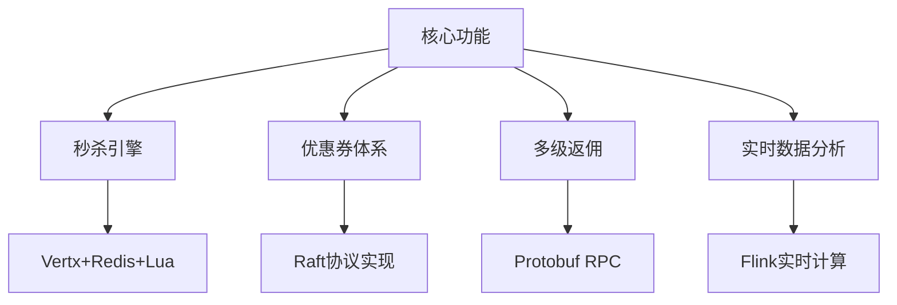
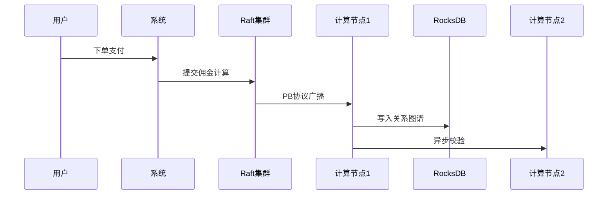

** Prometheus-Market（普罗米修斯营销中台）**
#### 技术定位：基于Vertx+WebFlux的响应式分布式营销系统



### **一、项目设计**
1. **技术组合**：
   - 用Vertx处理高并发请求（展示IO优势）
   - 用WebFlux实现后台管理（展示Spring生态）
   - 自研Raft节点实现分布式优惠券发放（强一致性）
   - Protobuf协议通信+ RocksDB存储（高性能）

2. **业务场景覆盖**：
   - 模拟电商大促场景（百万QPS）
   - 多层级分销返佣计算（复杂业务逻辑）
   - 全球化多时区支持（展示架构能力）

3. **性能可视化**：
   - 内置Prometheus监控看板
   - 压力测试对比报告（vs 传统Spring MVC）
   - GC日志分析工具集成


### **二、核心模块设计**
#### 模块1：闪电秒杀引擎
```java
// Vertx事件总线+Redis原子计数
vertx.eventBus().<String>consumer("seckill.start", msg -> {
  redisClient.decr(redisKey, res -> {
    if(res.result() >=0){
      raftCluster.propose(new SeckillTransaction(userId,skuId)); 
    }
  });
});
```


#### 模块2：多级返佣计算



#### 模块3：实时大屏
```python
# 模拟数据生成脚本（展示性能压测能力）
while True:
  print(f"QPS:{random.randint(800000,1200000)}")
  print(f"P99:{random.uniform(10,50)}ms") 
  time.sleep(0.1)
```

